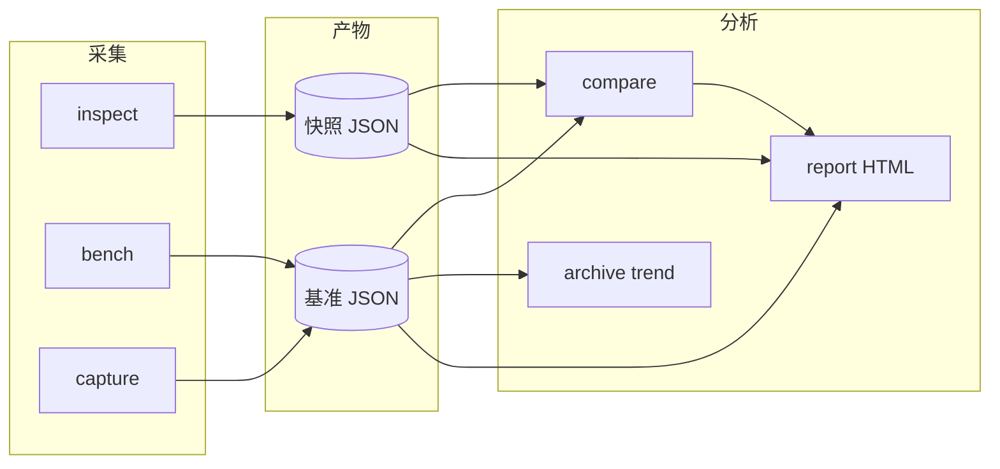
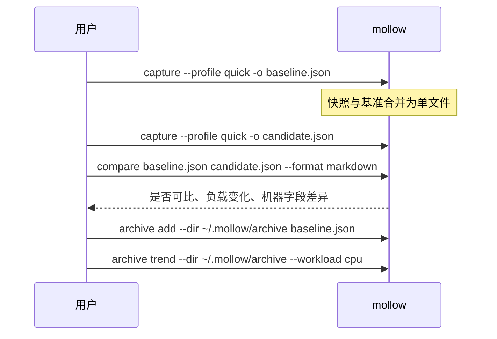

# Mollow

[English](README.md) | 简体中文

**Mollow** 是一个跨平台的机器环境探测与性能基线 CLI。它采集带版本号的硬件与运行时信息，
运行轻量、可复现的基准负载，并在时间或不同机器之间对比结果——且会明确说明何时差异具有统计意义。

Mollow 面向**环境审计**、**回归检查**与**基线追踪**，并不替代完整基准套件、持续性能分析器或系统调优工具。

---

## Mollow 能做什么

| 能力域 | 说明 |
| --- | --- |
| **机器快照**（`inspect`） | 操作系统、CPU、内存、存储卷、GPU、媒体编解码、电源、温控、已安装开发工具（rustc/cargo/git 等） |
| **实时监控**（`watch`） | 按固定间隔刷新内存、电源、温控 |
| **性能基准**（`bench` / `capture`） | 带版本号的 CPU、内存、存储、GPU（wgpu）、平台媒体负载；输出中位数与 MAD 统计 |
| **基线对比**（`compare`） | Schema/配置档/负载校验、严格环境检查、机器字段差异、回归/提升分类 |
| **报告渲染**（`report`） | 同一份 JSON 可输出终端、JSON、Markdown、语义化 HTML（中/英） |
| **本地档案**（`archive`） | 基线索引与按 workload 的趋势曲线 |

所有探测遵循**能力模型**：结果为 `available`、`unsupported`、`error` 或 `permission_denied`，
不会仅凭设备名称推断能力。

### 基准负载（v2）

| 领域 | Workload ID | 后端 |
| --- | --- | --- |
| CPU | `cpu.fnv1a-stream` | 主机端 FNV-1a 确定性输入哈希 |
| 内存 | `memory.sequential-copy` | 主机端顺序 `copy_from_slice` |
| 存储 | `storage.sequential-write-read` | 临时文件写入、`sync_all`、校验读回 |
| GPU | `gpu.wgpu-matrix-multiply` | wgpu 计算着色器（Metal / Vulkan / DX12） |
| 媒体（macOS） | `media.videotoolbox-h264-encode` | VideoToolbox 硬件 H.264 编码 |
| 媒体（Windows） | `media.media-foundation-h264-decode` | Media Foundation 硬件 H.264 解码 |
| 媒体（Linux） | `media.vaapi-h264-decode` | VA-API 硬件 H.264 解码 |

### 快照 Schema（v3）— `inspect` 采集内容

| 组件 | 示例字段 |
| --- | --- |
| `system` | 系统名称/版本、内核、架构、主机名 |
| `cpu` | 型号、物理/逻辑核心数、指令集特性 |
| `memory` | 总/可用内存、交换区 |
| `storage` | 挂载点、卷容量、文件系统类型 |
| `gpu` | 设备名、厂商、图形 API |
| `media` | 后端、硬件编解码能力列表 |
| `power` | 交流/电池、电量、低电量模式 |
| `thermal` | 温控状态、温度、传感器 |
| `runtimes` | rustc、cargo、git、node、python（若已安装） |

---

## 整体流程



**典型基线工作流**



---

## 安装

当前版本：**[v0.1.1](https://github.com/ingeniousfrog/Mollow/releases/tag/v0.1.1)**。
已提供 macOS（Apple Silicon / Intel）、Linux x86_64、Windows x86_64 预编译二进制。

### 按平台快速选择

| 平台 | 推荐方式 | 命令 |
| --- | --- | --- |
| **macOS** | Homebrew | `brew tap ingeniousfrog/tap && brew install mollow` |
| **Linux**（通用） | 安装脚本 | 见下方 [Linux → 方式 A](#linux) |
| **Ubuntu / Debian** | 专用脚本 | 见下方 [Linux → 方式 B](#linux) |
| **Windows** | PowerShell 脚本 | 见下方 [Windows → 方式 A](#windows) |
| **任意平台**（开发者） | 源码构建 | `cargo build --release -p mollow` |

> **暂不支持：** `apt install mollow` — Mollow 未进入 Debian/Ubuntu 官方软件源。
> 请使用 Ubuntu 安装脚本、Linux 版 Homebrew，或从 GitHub Releases 下载二进制。

安装完成后验证：

```bash
mollow --version
mollow inspect --format terminal --lang zh-CN
```

---

### macOS

#### 方式 A — Homebrew（推荐）

Mollow 是 CLI **Formula**（非 GUI 的 Cask），托管于
[ingeniousfrog/homebrew-tap](https://github.com/ingeniousfrog/homebrew-tap)：

```bash
brew tap ingeniousfrog/tap
brew install mollow
```

若 Homebrew 提示 untrusted tap，先执行：

```bash
brew trust ingeniousfrog/tap
```

升级 / 卸载：

```bash
brew upgrade mollow
brew uninstall mollow
```

支持 Apple Silicon（`aarch64`）与 Intel（`x86_64`）。

#### 方式 B — 安装脚本

从 GitHub Releases 下载对应架构的 tarball，默认安装到 `~/.local/bin`：

```bash
curl -fsSL https://raw.githubusercontent.com/ingeniousfrog/Mollow/main/packaging/install.sh | bash
```

安装到系统目录：

```bash
MOLLOW_INSTALL_DIR=/usr/local/bin curl -fsSL https://raw.githubusercontent.com/ingeniousfrog/Mollow/main/packaging/install.sh | sudo bash
```

#### 方式 C — 手动下载

从 [GitHub Releases](https://github.com/ingeniousfrog/Mollow/releases) 下载
`mollow-aarch64-apple-darwin.tar.gz` 或 `mollow-x86_64-apple-darwin.tar.gz`，
解压出 `mollow` 并加入 `PATH`。

---

### Linux

Mollow **不支持** `apt`、`dnf` 等官方包管理器直接安装。请使用以下方式之一。

#### 方式 A — 通用安装脚本（推荐）

适用于 Linux x86_64（也支持 macOS）。默认安装路径：`~/.local/bin`。

```bash
curl -fsSL https://raw.githubusercontent.com/ingeniousfrog/Mollow/main/packaging/install.sh | bash
```

安装到系统目录：

```bash
MOLLOW_INSTALL_DIR=/usr/local/bin curl -fsSL https://raw.githubusercontent.com/ingeniousfrog/Mollow/main/packaging/install.sh | sudo bash
```

#### 方式 B — Ubuntu / Debian 专用脚本

面向 Ubuntu/Debian x86_64。默认安装路径：`/usr/local/bin`。

```bash
curl -fsSL https://raw.githubusercontent.com/ingeniousfrog/Mollow/main/packaging/install-ubuntu.sh | sudo bash
```

仅安装到当前用户目录（无需 `sudo`）：

```bash
curl -fsSL https://raw.githubusercontent.com/ingeniousfrog/Mollow/main/packaging/install-ubuntu.sh -o install-ubuntu.sh
MOLLOW_INSTALL_DIR="$HOME/.local/bin" bash install-ubuntu.sh
```

依赖 `curl` 与 `tar`（若缺失：`sudo apt-get install -y curl`）。

#### 方式 C — Linux 版 Homebrew

```bash
brew tap ingeniousfrog/tap
brew install mollow
```

#### 方式 D — 手动下载

从 [GitHub Releases](https://github.com/ingeniousfrog/Mollow/releases) 下载
`mollow-x86_64-unknown-linux-gnu.tar.gz`，解压 `mollow` 并加入 `PATH`。

---

### Windows

#### 方式 A — PowerShell 安装脚本（推荐）

安装到 `%LOCALAPPDATA%\Programs\Mollow\bin`，并写入用户 `PATH`：

```powershell
irm https://raw.githubusercontent.com/ingeniousfrog/Mollow/main/packaging/install.ps1 | iex
```

指定版本：

```powershell
irm https://raw.githubusercontent.com/ingeniousfrog/Mollow/main/packaging/install.ps1 -OutFile install.ps1
.\install.ps1 -Version 0.1.1
```

安装后**重启终端**，然后：

```powershell
mollow --version
```

#### 方式 B — Scoop

Manifest 模板：[`packaging/scoop/mollow.json`](packaging/scoop/mollow.json)。加入 bucket 后：

```powershell
scoop install mollow
```

#### 方式 C — winget

Manifest 模板：[`packaging/winget/ingeniousfrog.Mollow.yaml`](packaging/winget/ingeniousfrog.Mollow.yaml)。
可参考并提交至 [microsoft/winget-pkgs](https://github.com/microsoft/winget-pkgs)。

#### 方式 D — 手动下载

从 [GitHub Releases](https://github.com/ingeniousfrog/Mollow/releases) 下载
`mollow-x86_64-pc-windows-msvc.zip`，解压 `mollow.exe` 并将其目录加入 `PATH`。

---

### 源码构建

环境要求：Rust **1.85+**（见 `Cargo.toml` 中的 `rust-version`）。

```bash
git clone https://github.com/ingeniousfrog/Mollow.git
cd Mollow
cargo build --release -p mollow
./target/release/mollow --version
```

可将二进制加入 `PATH`，或通过 `cargo run --release -p mollow --` 调用。

> 性能基线请使用 **release** 构建。debug 构建可运行，但会提示不可作为可比基线。

---

### Release 产物与维护者文档

| 产物 | 平台 |
| --- | --- |
| `mollow-aarch64-apple-darwin.tar.gz` | macOS Apple Silicon |
| `mollow-x86_64-apple-darwin.tar.gz` | macOS Intel |
| `mollow-x86_64-unknown-linux-gnu.tar.gz` | Linux x86_64 |
| `mollow-x86_64-pc-windows-msvc.zip` | Windows x86_64 |

发布新版本：推送 `v*` tag（见 [`.github/workflows/release.yml`](.github/workflows/release.yml)），然后更新 checksum 并推送 Homebrew tap：

```bash
./packaging/update-homebrew-sha256.sh <version>
./packaging/update-package-checksums.sh <version>
./packaging/push-homebrew-tap.sh
```

更多说明：

| 文档 | 内容 |
| --- | --- |
| [docs/packaging.md](docs/packaging.md) | 全平台安装、Scoop、winget |
| [docs/homebrew.md](docs/homebrew.md) | Homebrew Formula 维护流程 |

---

## 命令与参数

### 通用选项

多数命令支持：

| 参数 | 取值 | 默认值 | 说明 |
| --- | --- | --- | --- |
| `--format` | `terminal`, `json`, `markdown`, `html` | 见各命令 | 输出格式 |
| `--lang` | `english`, `zh-CN` | `english` | 报告语言（终端 / Markdown / HTML） |
| `--output <路径>` | 文件路径 | 标准输出 | 写入文件而非 stdout |

基准相关命令另有：

| 参数 | 取值 | 默认值 | 说明 |
| --- | --- | --- | --- |
| `--profile` | `quick`, `standard` | `quick` | 采样次数与输入规模（[详见](docs/benchmarks.md)） |

---

### `mollow inspect`

仅采集**机器快照**，不运行基准。

```bash
mollow inspect [选项]
```

| 选项 | 默认值 | 说明 |
| --- | --- | --- |
| `--format` | `terminal` | `terminal` · `json` · `markdown` · `html` |
| `--lang` | `english` | `english` · `zh-CN` |
| `--output` | — | 将渲染结果保存到文件 |

**示例**

```bash
# 终端可读摘要（中文）
mollow inspect --format terminal --lang zh-CN

# 供工具链使用的 JSON
mollow inspect --format json --output snapshot.json

# 可分享的 HTML 报告
mollow inspect --format html --lang english --output inspect.html
```

---

### `mollow bench`

运行基准负载，不自动写入合并的 capture 文件。

```bash
mollow bench [选项]
```

| 选项 | 默认值 | 说明 |
| --- | --- | --- |
| `--profile` | `quick` | `quick`（3 次采样）· `standard`（5 次采样） |
| `--format` | `terminal` | 输出格式 |
| `--lang` | `english` | 报告语言 |
| `--output` | — | 输出文件路径 |

**示例**

```bash
mollow bench --profile quick --format terminal
mollow bench --profile standard --format json --output bench-standard.json
```

---

### `mollow capture`

将快照与基准**合并为单个 JSON 文件**（推荐用于基线归档）。

```bash
mollow capture [选项]
```

| 选项 | 默认值 | 说明 |
| --- | --- | --- |
| `--profile` | `quick` | 基准配置档 |
| `--format` | `json` | 默认可归档 JSON；可用 `terminal` 快速查看 |
| `--lang` | `english` | 报告语言 |
| `--output` | — | **建议指定**基线文件路径 |

**示例**

```bash
mollow capture --profile quick --output baseline.json
mollow capture --profile standard --format json --output release-baseline.json
```

---

### `mollow compare`

将**基线**与一个或多个**候选**文件对比。

支持两类输入：

- **完整基准**（含 `started_at_unix_ms`）→ 负载回归/提升分析
- **仅快照**（仅 `captured_at_unix_ms`）→ 机器字段差异，无负载变化

```bash
mollow compare [选项] <基线> <候选> [更多候选...]
```

| 参数 / 选项 | 说明 |
| --- | --- |
| `<基线>` | 参考 JSON 文件 |
| `<候选>` | 与基线对比的文件 |
| `[更多候选...]` | 可选，一次对比多个候选 |
| `--format` | 默认 `terminal` |
| `--lang` | 报告语言 |
| `--output` | 对比报告输出路径 |

**示例**

```bash
mollow compare baseline.json candidate.json
mollow compare baseline.json run-a.json run-b.json --format markdown -o diff.md
mollow compare old-snapshot.json new-snapshot.json --lang zh-CN
```

**可比性（摘要）**：当 schema、配置档、release 构建、负载参数或**运行环境**（电源来源、电池供电、
低电量模式、温控 warning/critical）不一致时，标记为**不可比**。详见 [docs/comparison.md](docs/comparison.md)。

负载中位数变化按 **±5%**（500 基点）划分回归 / 提升 / 稳定。

---

### `mollow report`

将已保存的 Mollow JSON（快照、基准或对比报告）重新渲染为其它格式。

```bash
mollow report [选项] <输入文件>
```

| 选项 | 默认值 | 说明 |
| --- | --- | --- |
| `<输入文件>` | — | 自动识别文档类型的 `.json` |
| `--format` | `terminal` | 输出格式 |
| `--lang` | `english` | 报告语言 |
| `--output` | — | 输出路径（HTML 建议显式指定） |

**示例**

```bash
mollow report baseline.json --format html --output report.html
mollow report comparison.json --format markdown --lang zh-CN
```

---

### `mollow watch`

按固定间隔监控 **内存**、**电源**、**温控**（类似 `gpustat -i 1` 的刷新体验，但面向环境状态而非 GPU 利用率）。

```bash
mollow watch [选项]
```

| 选项 | 默认值 | 说明 |
| --- | --- | --- |
| `-i`, `--interval` | `1` | 刷新间隔（秒） |
| `--fields` | `memory,power,thermal` | 逗号分隔的监控字段 |
| `--lang` | `english` | 报告语言 |
| `--count` | — | 刷新 N 次后停止 |

**示例**

```bash
mollow watch -i 1
mollow watch -i 5 --fields power,thermal --lang zh-CN
```

电池供电与温控 warning/critical 状态会在终端高亮显示。

---

### `mollow archive`

管理本地基准 JSON **目录**（索引与趋势）。

#### `archive add`

```bash
mollow archive add --dir <档案目录> <基准.json>
```

将元数据写入档案索引；输入须为基准运行文件（如 `capture` 产物）。

#### `archive list`

```bash
mollow archive list --dir <档案目录> [--format terminal|json|markdown|html] [--lang english|zh-CN]
```

#### `archive trend`

```bash
mollow archive trend --dir <档案目录> --workload <名称> [--format ...] [--lang ...]
```

`--workload` 取值：`cpu`、`memory`、`storage`、`gpu`、`media`（默认 `cpu`）。

**示例**

```bash
mkdir -p ~/.mollow/archive
mollow capture --profile quick -o run-2025-06-19.json
mollow archive add --dir ~/.mollow/archive run-2025-06-19.json
mollow archive list --dir ~/.mollow/archive --format markdown
mollow archive trend --dir ~/.mollow/archive --workload gpu --lang zh-CN
```

---

## 基准配置档

| 配置档 | 采样次数 | CPU 输入 | 内存缓冲 | 存储文件 | 适用场景 |
| --- | ---: | ---: | ---: | ---: | --- |
| `quick` | 3 | 4 MiB | 16 MiB | 8 MiB | 日常检查、CI 冒烟 |
| `standard` | 5 | 32 MiB | 64 MiB | 64 MiB | 发布基线、长期归档 |

预热次数、统计方法与存储安全说明：[docs/benchmarks.md](docs/benchmarks.md)。

---

## 平台支持

| 平台 | 系统 / CPU / 内存 / 存储 | GPU | 媒体 | 电源 | 温控 |
| --- | --- | --- | --- | --- | --- |
| macOS | 原生 API、sysctl | `system_profiler` | VideoToolbox | IOKit | SMC / 温控 |
| Linux | `/proc`、sysfs | DRM | VA-API / V4L2 | power-supply | thermal zone |
| Windows | Win32 / NT | DXGI | Media Foundation | Win32 电源 | WMI |

---

## Schema 版本

| 产物 | Schema | 文件 |
| --- | --- | --- |
| 机器快照 | v3.0.0 | `schemas/machine-snapshot-v3.schema.json` |
| 基准运行 | v3.0.0 | `schemas/benchmark-run-v3.schema.json` |
| 对比报告 | v2.0.0 | `schemas/comparison-report-v2.schema.json` |

---

## 开发与文档

```bash
cargo fmt --all --check
cargo clippy --workspace --all-targets -- -D warnings
cargo test --workspace
cargo test --workspace --release
```

| 文档 | 内容 |
| --- | --- |
| [docs/architecture.md](docs/architecture.md) | Crate 边界与能力语义 |
| [docs/benchmarks.md](docs/benchmarks.md) | 负载、配置档、统计方法 |
| [docs/comparison.md](docs/comparison.md) | 可比性与严格环境规则 |
| [docs/release-verification.md](docs/release-verification.md) | 发布前验证清单 |
| [docs/homebrew.md](docs/homebrew.md) | Formula 打包说明 |
| [docs/packaging.md](docs/packaging.md) | 跨平台安装与 Scoop/winget |

---

## 许可证

Apache License 2.0 — 见 [`LICENSE`](LICENSE)。
