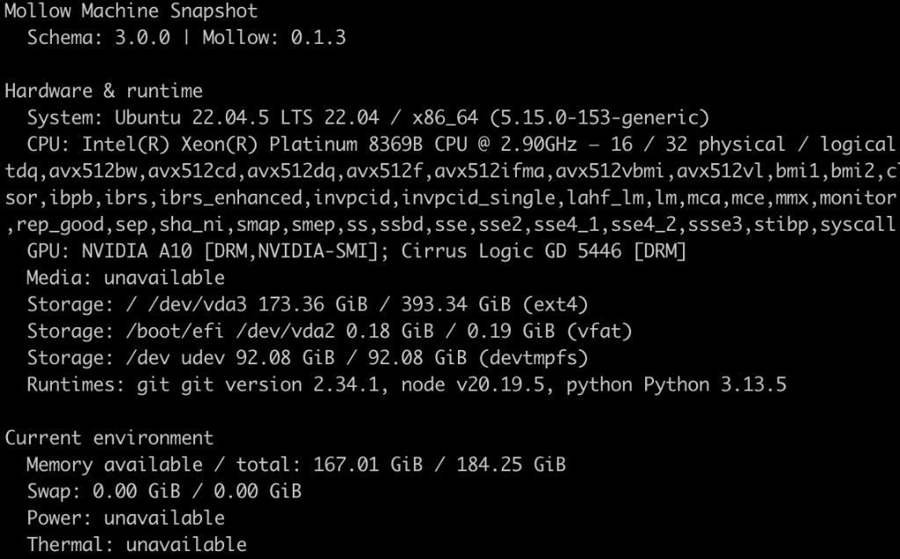
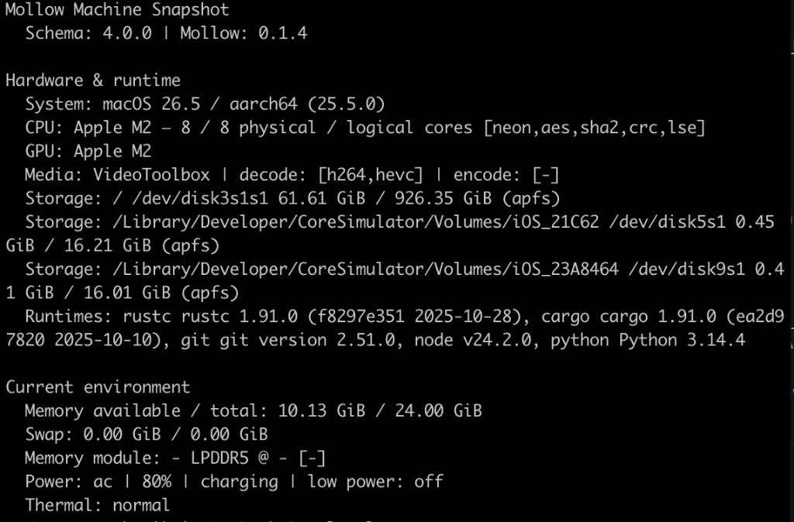
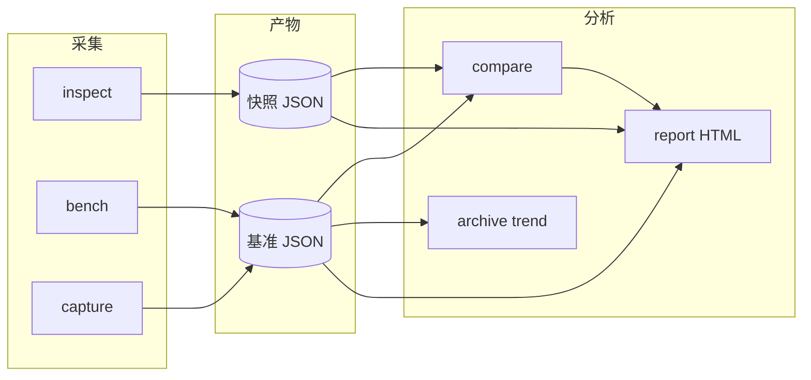
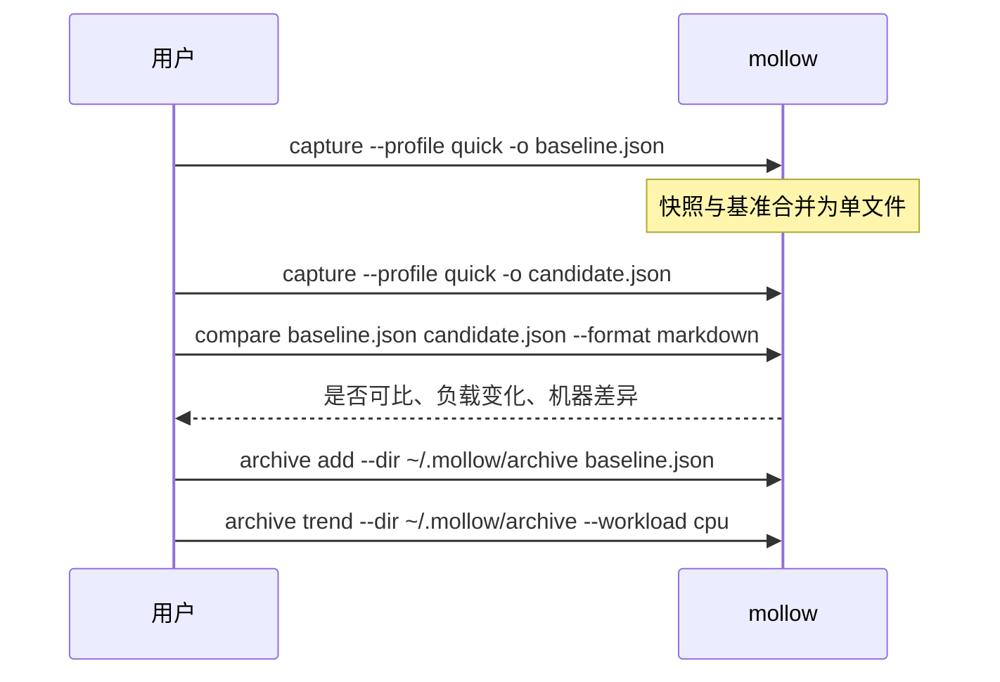

# Mollow

[English](README.md) | 简体中文

跨平台 **机器环境探测**、**性能基线** 与 **环境感知对比** CLI。

> **可视化导览：** [Mollow 展示页](https://ingeniousfrog.github.io/Mollow/) — 安装路径、架构与典型工作流一页概览。

---

## 概述

Mollow 采集带版本号的硬件与运行时信息，运行轻量、可复现的基准负载，并在时间或不同机器之间对比结果——且会明确说明何时差异具有统计意义。

**主要场景：** 环境审计、回归检查、基线追踪。

**非目标：** 完整基准套件、持续性能分析、系统调优、硬件导购天梯。

所有探测遵循**能力模型**：结果为 `available`、`unsupported`、`error` 或 `permission_denied`，不会仅凭设备名称推断能力。

---

## 功能

| 能力域 | 命令 | 说明 |
| --- | --- | --- |
| 机器快照 | `inspect` | 操作系统、CPU、内存（含内存条）、存储、GPU、媒体、电源、温控、运行时 |
| 硬件目录 | `inspect --enrich`、`capture --enrich` | 可选离线规格、架构摘要、基准参考上下文 |
| 实时监控 | `watch` | 按固定间隔刷新内存、电源、温控 |
| 性能基准 | `bench`、`capture` | CPU / 内存 / 存储 / GPU（wgpu）/ 平台媒体负载（中位数 + MAD） |
| 基线对比 | `compare` | Schema 校验、严格环境检查、回归分类 |
| 报告渲染 | `report` | 终端、JSON、Markdown、语义化 HTML（中/英） |
| 本地档案 | `archive` | 基线索引与按 workload 的趋势曲线 |

---

## 快速开始

```bash
# macOS
brew tap ingeniousfrog/tap && brew install mollow

# Linux（Ubuntu / Debian / 云服务器）
curl -fsSL https://raw.githubusercontent.com/ingeniousfrog/Mollow/main/packaging/install-ubuntu.sh | sudo bash

# Windows（PowerShell）
irm https://raw.githubusercontent.com/ingeniousfrog/Mollow/main/packaging/install.ps1 | iex
```

验证并采集基线：

```bash
mollow --version
mollow inspect --format terminal --lang zh-CN
mollow capture --profile quick --output baseline.json
```

完整安装方式见 [安装](#安装)。

---

## 硬件 enrichment

使用 `--enrich` 从嵌入式离线目录（[`data/hardware/catalog.json`](data/hardware/catalog.json)）附加 `hardware_context`。不加该参数时 enrichment 为 `unsupported`，快照保持最小结构。

```bash
mollow inspect --enrich --format terminal --lang zh-CN
mollow capture --enrich --profile quick --output baseline.json
```

**提供：** 代号、制程、频率、内存类型、架构摘要、参考链接、HTML 简化示意图，以及可选的本机基准与目录参考对比。

**不提供：** 在线 API、天梯排名、厂商官方架构图。

### 目录覆盖范围（v2026.06）

| 类别 | 覆盖 | 匹配说明 |
| --- | --- | --- |
| **CPU** | Intel Core、AMD Ryzen、**Apple Silicon M1–M5** | 归一化型号字符串查找 |
| **GPU** | NVIDIA RTX、AMD Radeon RX、**Apple Silicon M1–M5** | macOS 集成 GPU 报芯片名（如 `Apple M2`）→ **Exact** 匹配 |
| **内存** | DDR4/DDR5 profile、LPDDR5（Apple Silicon / 移动端） | 内存条详情取决于 OS 是否暴露（Linux DMI、macOS `system_profiler`） |

Apple Silicon 的 **Pro / Max / Ultra** 归入同一代条目（与 CPU 目录粒度一致）。GPU 核数因 SKU 而异，优先来自平台探测，而非目录排名。

参考分数为 **合成参考指数**，用于相对上下文，非公开跑分复现。

详见 [docs/hardware-enrichment.md](docs/hardware-enrichment.md) · [ADR-0002](docs/adr/0002-hardware-enrichment-decisions.md)

---

## 示例输出

`mollow inspect --format terminal --lang zh-CN` 终端输出（v0.1.4）：

<table>
  <tr>
    <td align="center"><br/><sub>Ubuntu 云 GPU（阿里云 ECS）</sub></td>
    <td align="center"><br/><sub>macOS（Apple Silicon）</sub></td>
  </tr>
</table>

---

## 工作流



**典型基线流程**



---

## 安装

**当前版本：** [v0.1.4](https://github.com/ingeniousfrog/Mollow/releases/tag/v0.1.4)

预编译包：macOS（Apple Silicon + Intel）、Linux x86_64（musl 静态 + glibc）、Windows x86_64。

### 版本说明

**v0.1.4**

- 快照与基准 Schema **v4**
- 可选 `--enrich` 离线硬件目录（CPU/GPU/内存规格、架构摘要、HTML 示意图、基准参考对比）
- Apple Silicon 目录：**M1–M5** CPU 与 GPU（macOS 芯片名 Exact 匹配）
- 内存条探测（Linux DMI、macOS `system_profiler`）

**更早版本**

- **v0.1.3** — Linux GPU 可读型号（`nvidia-smi`、`pci.ids`）
- **v0.1.2** — Linux 安装脚本默认 musl 静态包；修复旧系统 `GLIBC_* not found`

### 按平台安装

| 平台 | 推荐 | 命令 |
| --- | --- | --- |
| macOS | Homebrew | `brew tap ingeniousfrog/tap && brew install mollow` |
| Ubuntu / Debian / VPS | 安装脚本（musl） | `curl -fsSL …/packaging/install-ubuntu.sh \| sudo bash` |
| Linux（其它） | 安装脚本（musl） | `curl -fsSL …/packaging/install.sh \| bash` |
| Windows | PowerShell | `irm …/packaging/install.ps1 \| iex` |
| 开发者 | 源码 | `cargo build --release -p mollow` |

完整 URL 与其它方式（Scoop、winget、手动下载、Linux Homebrew）：[docs/packaging.md](docs/packaging.md)。

> Mollow **未**进入 Debian/Ubuntu 官方源，无 `apt install mollow`。

### 二进制兼容性

| 产物 | 架构 | 要求 | 脚本默认？ |
| --- | --- | --- | --- |
| `mollow-x86_64-unknown-linux-musl.tar.gz` | Linux x86_64 | musl 静态；Ubuntu 18.04–24.04、云 VPS | 是 |
| `mollow-x86_64-unknown-linux-gnu.tar.gz` | Linux x86_64 | glibc 2.35+（约 Ubuntu 22.04+） | 仅手动 |
| `mollow-aarch64-apple-darwin.tar.gz` | macOS ARM64 | macOS 11+ | Homebrew / 脚本 |
| `mollow-x86_64-apple-darwin.tar.gz` | macOS Intel | macOS 11+ | Homebrew / 脚本 |
| `mollow-x86_64-pc-windows-msvc.zip` | Windows x64 | Windows 10+、PowerShell 5.1+ | `install.ps1` |

暂不提供 Linux ARM64、Windows ARM64 预编译包，请从源码构建。

### 升级与卸载

| 方式 | 升级 | 卸载 |
| --- | --- | --- |
| Homebrew | `brew update && brew upgrade mollow` | `brew uninstall mollow` |
| 安装脚本 | 重新运行安装脚本 | 删除安装目录中的二进制 |
| Windows PowerShell | 重新运行 `install.ps1` | 删除 `%LOCALAPPDATA%\Programs\Mollow\bin` |
| Scoop | `scoop update mollow` | `scoop uninstall mollow` |
| 手动 | 从 [Releases](https://github.com/ingeniousfrog/Mollow/releases) 替换二进制 | 从 `PATH` 删除 |
| 源码 | `git pull && cargo build --release -p mollow` | 删除构建产物 |

指定版本：`MOLLOW_VERSION=0.1.4`（脚本）或 `.\install.ps1 -Version 0.1.4`（Windows）。

### 常见问题

**Linux 报 `GLIBC_* not found`** — 安装了 glibc 链接版二进制。删除旧文件后用 musl 脚本重装（v0.1.2 起默认 musl）：

```bash
sudo rm -f /usr/local/bin/mollow ~/.local/bin/mollow
curl -fsSL https://raw.githubusercontent.com/ingeniousfrog/Mollow/main/packaging/install-ubuntu.sh | sudo bash
```

或显式指定 musl：`MOLLOW_LINUX_TARGET=x86_64-unknown-linux-musl`。

---

## 命令参考

### 通用选项

| 参数 | 取值 | 默认 | 说明 |
| --- | --- | --- | --- |
| `--format` | `terminal`, `json`, `markdown`, `html` | 见各命令 | 输出格式 |
| `--lang` | `english`, `zh-CN` | `english` | 报告语言 |
| `--output <路径>` | 文件路径 | 标准输出 | 写入文件 |

基准命令另支持 `--profile quick|standard`（[详见](docs/benchmarks.md)）。

### `mollow inspect`

采集机器快照（不含基准）。

| 选项 | 默认 | 说明 |
| --- | --- | --- |
| `--format` | `terminal` | 输出格式 |
| `--enrich` | 关 | 附加离线硬件目录 |
| `--output` | — | 保存渲染结果 |

```bash
mollow inspect --format json --output snapshot.json
mollow inspect --enrich --format html --lang zh-CN --output inspect.html
```

### `mollow bench`

运行基准，不写入合并 capture 文件。

```bash
mollow bench --profile quick --format terminal
mollow bench --profile standard --format json --output bench.json
```

### `mollow capture`

快照与基准合并为单个 JSON（推荐用于基线）。

```bash
mollow capture --profile quick --output baseline.json
mollow capture --enrich --profile standard --output release-baseline.json
```

### `mollow compare`

基线与一个或多个候选文件对比（基准运行或纯快照）。

```bash
mollow compare baseline.json candidate.json
mollow compare baseline.json run-a.json run-b.json --format markdown -o diff.md
```

基准对比要求 schema、配置档、release 构建、负载参数与环境（电源、温控）一致。中位数变化阈值：**±5%**（500 基点）。详见 [docs/comparison.md](docs/comparison.md)。

### `mollow report`

将已保存 JSON 重新渲染为其它格式。

```bash
mollow report baseline.json --format html --output report.html
```

### `mollow watch`

按固定间隔监控内存、电源、温控。

```bash
mollow watch -i 1
mollow watch -i 5 --fields power,thermal --lang zh-CN
```

### `mollow archive`

本地基线目录：`archive add`、`archive list`、`archive trend --workload cpu|memory|storage|gpu|media`。

```bash
mkdir -p ~/.mollow/archive
mollow capture --profile quick -o run.json
mollow archive add --dir ~/.mollow/archive run.json
mollow archive trend --dir ~/.mollow/archive --workload gpu
```

---

## 数据模型

### 快照 Schema（v4）

| 组件 | 示例 |
| --- | --- |
| `system` | 操作系统、内核、架构、主机名 |
| `cpu` | 型号、核心数、指令集 |
| `memory` | 总/可用内存、交换区、内存条类型/频率 |
| `storage` | 挂载点、卷容量、文件系统 |
| `gpu` | 设备名、厂商、图形 API |
| `media` | 硬件编解码能力 |
| `power` / `thermal` | 交流/电池、电量、温控状态 |
| `runtimes` | rustc、cargo、git、node、python（若已安装） |
| `hardware_context` | 可选目录 enrichment（`--enrich`） |

Schema 文件：[`schemas/machine-snapshot-v4.schema.json`](schemas/machine-snapshot-v4.schema.json)

### 基准负载（v2）

| 领域 | Workload ID | 后端 |
| --- | --- | --- |
| CPU | `cpu.fnv1a-stream` | 主机端 FNV-1a 哈希 |
| 内存 | `memory.sequential-copy` | 顺序 `copy_from_slice` |
| 存储 | `storage.sequential-write-read` | 临时文件写/sync/读 |
| GPU | `gpu.wgpu-matrix-multiply` | wgpu（Metal / Vulkan / DX12） |
| 媒体（macOS） | `media.videotoolbox-h264-encode` | VideoToolbox |
| 媒体（Windows） | `media.media-foundation-h264-decode` | Media Foundation |
| 媒体（Linux） | `media.vaapi-h264-decode` | VA-API |

### 基准配置档

| 配置档 | 采样 | CPU 输入 | 内存缓冲 | 存储文件 | 场景 |
| --- | ---: | ---: | ---: | ---: | --- |
| `quick` | 3 | 4 MiB | 16 MiB | 8 MiB | CI 冒烟、日常检查 |
| `standard` | 5 | 32 MiB | 64 MiB | 64 MiB | 发布基线 |

完整参数：[docs/benchmarks.md](docs/benchmarks.md)

### Schema 版本

| 产物 | 版本 | 文件 |
| --- | --- | --- |
| 机器快照 | v4.0.0 | `schemas/machine-snapshot-v4.schema.json` |
| 基准运行 | v4.0.0 | `schemas/benchmark-run-v4.schema.json` |
| 对比报告 | v2.0.0 | `schemas/comparison-report-v2.schema.json` |

---

## 平台探测能力

`inspect` 在各 OS 上可采集的内容（与[二进制兼容性](#二进制兼容性)不同）：

| 平台 | 系统 / CPU / 内存 / 存储 | GPU | 媒体 | 电源 | 温控 |
| --- | --- | --- | --- | --- | --- |
| macOS | 原生 API、sysctl | `system_profiler` | VideoToolbox | IOKit | SMC |
| Linux | `/proc`、sysfs | DRM、nvidia-smi、pci.ids | VA-API / V4L2 | power-supply | thermal zone |
| Windows | Win32 / NT | DXGI | Media Foundation | Win32 | WMI |

---

## 开发

环境：Rust **1.85+**（见 `Cargo.toml` 中 `rust-version`）。

```bash
cargo fmt --all --check
cargo clippy --workspace --all-targets -- -D warnings
cargo test --workspace
cargo build --release -p mollow
```

性能基线请使用 **release** 构建。

### 文档索引

| 文档 | 内容 |
| --- | --- |
| [docs/architecture.md](docs/architecture.md) | Crate 边界与能力语义 |
| [docs/hardware-enrichment.md](docs/hardware-enrichment.md) | 离线目录、`--enrich` |
| [docs/benchmarks.md](docs/benchmarks.md) | 负载、配置档、统计 |
| [docs/comparison.md](docs/comparison.md) | 可比性规则 |
| [docs/packaging.md](docs/packaging.md) | 安装、Scoop、winget |
| [docs/homebrew.md](docs/homebrew.md) | Homebrew Formula |
| [docs/release-verification.md](docs/release-verification.md) | 发布前验证 |

### 发布（维护者）

推送 `v*` tag → [`.github/workflows/release.yml`](.github/workflows/release.yml) 构建并发布 GitHub Release。配置 `HOMEBREW_TAP_TOKEN` 后自动更新 [homebrew-tap](https://github.com/ingeniousfrog/homebrew-tap)。

发布后刷新 packaging 校验和：

```bash
./packaging/update-homebrew-sha256.sh <version>
./packaging/update-package-checksums.sh <version>
```

---

## 许可证

Apache License 2.0 — 见 [`LICENSE`](LICENSE)。
