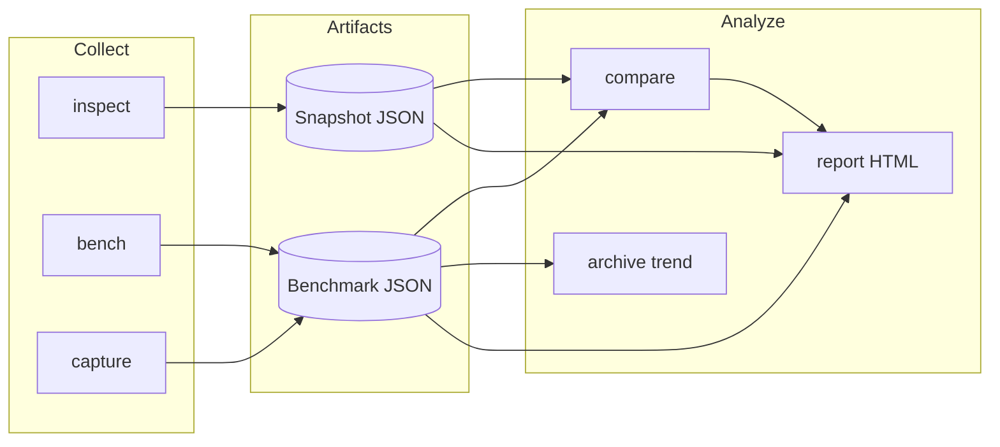
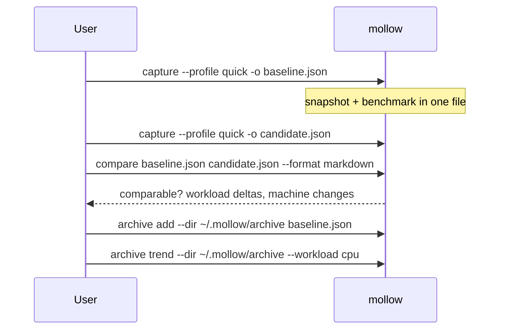

# Mollow

English | [简体中文](README-CN.md)

**Mollow** is a cross-platform CLI for machine inspection and performance baselines.
It collects versioned hardware and runtime facts, runs small reproducible workloads,
and compares results across time or machines—with explicit rules for when a diff is
statistically meaningful.

Mollow is built for **environment audits**, **regression checks**, and **baseline
tracking**. It is not a replacement for full benchmark suites, continuous profilers,
or system tuning tools.

---

## What Mollow does

| Area | Capability |
| --- | --- |
| **Machine snapshot** (`inspect`) | OS, CPU, memory, storage volumes, GPU, media codecs, power, thermal state, installed runtimes |
| **Benchmarks** (`bench` / `capture`) | Versioned CPU, memory, storage, GPU (wgpu), and platform media workloads with median + MAD statistics |
| **Comparison** (`compare`) | Schema/profile/workload validation, strict environment checks, field-level machine diffs, regression classification |
| **Reporting** (`report`) | Same artifact rendered as terminal, JSON, Markdown, or semantic HTML (English / 简体中文) |
| **Archive** (`archive`) | Local baseline index and per-workload trend lines |

Every probe uses a **capability model**: values are `available`, `unsupported`, `error`,
or `permission_denied`—never inferred from device names alone.

### Benchmark workloads (v2)

| Domain | Workload ID | Backend |
| --- | --- | --- |
| CPU | `cpu.fnv1a-stream` | Host FNV-1a hash over deterministic input |
| Memory | `memory.sequential-copy` | Host sequential `copy_from_slice` |
| Storage | `storage.sequential-write-read` | Temp-file write, `sync_all`, verified read |
| GPU | `gpu.wgpu-matrix-multiply` | wgpu compute shader (Metal / Vulkan / DX12) |
| Media (macOS) | `media.videotoolbox-h264-encode` | VideoToolbox hardware H.264 encode |
| Media (Windows) | `media.media-foundation-h264-decode` | Media Foundation hardware H.264 decode |
| Media (Linux) | `media.vaapi-h264-decode` | VA-API hardware H.264 decode |

### Snapshot schema (v3) — fields collected by `inspect`

| Component | Examples |
| --- | --- |
| `system` | OS name/version, kernel, architecture, hostname |
| `cpu` | Model, physical/logical cores, ISA features |
| `memory` | Total/available RAM, swap usage |
| `storage` | Mount points, volume size, filesystem type |
| `gpu` | Device name, vendor, APIs |
| `media` | Backend, hardware decode/encode codec lists |
| `power` | AC/battery, charge %, low-power mode |
| `thermal` | State, temperature, sensor |
| `runtimes` | rustc, cargo, git, node, python (when present) |

---

## How it fits together



**Typical baseline workflow**



---

## Installation

### Build from source

Requirements: Rust **1.85+** (`rust-version` in `Cargo.toml`).

```bash
git clone https://github.com/ingeniousfrog/Mollow.git
cd Mollow
cargo build --release -p mollow
./target/release/mollow --version
```

Add the binary to your `PATH`, or invoke via `cargo run --release -p mollow --`.

> Use a **release** build for performance baselines. Debug builds run but emit a
> comparability warning.

### Homebrew (macOS, after first GitHub Release)

Mollow is a CLI **Formula** (not a GUI Cask). It can live in the same
[ingeniousfrog/homebrew-tap](https://github.com/ingeniousfrog/homebrew-tap) as other tools:

```bash
brew tap ingeniousfrog/tap
brew install mollow
```

See [docs/homebrew.md](docs/homebrew.md) and `packaging/homebrew/mollow.rb` for the
maintainer release workflow.

---

## Command reference

### Shared flags

Most commands accept:

| Flag | Values | Default | Description |
| --- | --- | --- | --- |
| `--format` | `terminal`, `json`, `markdown`, `html` | see per-command | Output format |
| `--lang` | `english`, `zh-CN` | `english` | Report language (terminal / markdown / html) |
| `--output <PATH>` | file path | stdout | Write result to file instead of stdout |

Benchmark-related commands also accept:

| Flag | Values | Default | Description |
| --- | --- | --- | --- |
| `--profile` | `quick`, `standard` | `quick` | Sample count and input sizes ([details](docs/benchmarks.md)) |

---

### `mollow inspect`

Collect a **machine snapshot only** (no benchmarks).

```bash
mollow inspect [OPTIONS]
```

| Option | Default | Description |
| --- | --- | --- |
| `--format` | `terminal` | `terminal` · `json` · `markdown` · `html` |
| `--lang` | `english` | `english` · `zh-CN` |
| `--output` | — | Save rendered output to a file |

**Examples**

```bash
# Human-readable summary (Chinese labels)
mollow inspect --format terminal --lang zh-CN

# Machine-readable snapshot for tooling
mollow inspect --format json --output snapshot.json

# Shareable HTML report
mollow inspect --format html --lang english --output inspect.html
```

---

### `mollow bench`

Run benchmark workloads **without** saving a combined capture file (stdout or `--output`).

```bash
mollow bench [OPTIONS]
```

| Option | Default | Description |
| --- | --- | --- |
| `--profile` | `quick` | `quick` (3 samples) · `standard` (5 samples) |
| `--format` | `terminal` | Output format |
| `--lang` | `english` | Report language |
| `--output` | — | Output file path |

**Examples**

```bash
mollow bench --profile quick --format terminal
mollow bench --profile standard --format json --output bench-standard.json
```

---

### `mollow capture`

Snapshot **plus** benchmark in a **single JSON artifact** (recommended for baselines).

```bash
mollow capture [OPTIONS]
```

| Option | Default | Description |
| --- | --- | --- |
| `--profile` | `quick` | Benchmark profile |
| `--format` | `json` | Default is JSON for archival; use `terminal` for a quick read |
| `--lang` | `english` | Report language |
| `--output` | — | **Strongly recommended** — baseline file path |

**Examples**

```bash
mollow capture --profile quick --output baseline.json
mollow capture --profile standard --format json --output release-baseline.json
```

---

### `mollow compare`

Diff a **baseline** against one or more **candidates**.

Accepts:

- **Benchmark runs** (`started_at_unix_ms` present) → workload regression/improvement
- **Snapshots only** (`captured_at_unix_ms` only) → machine field changes, no workload deltas

```bash
mollow compare [OPTIONS] <BASELINE> <CANDIDATE> [MORE_CANDIDATES...]
```

| Argument / option | Description |
| --- | --- |
| `<BASELINE>` | Reference JSON file |
| `<CANDIDATE>` | File to compare against baseline |
| `[MORE_CANDIDATES...]` | Optional additional candidates in one invocation |
| `--format` | Default `terminal` |
| `--lang` | Report language |
| `--output` | Write comparison report to file |

**Examples**

```bash
mollow compare baseline.json candidate.json
mollow compare baseline.json run-a.json run-b.json --format markdown -o diff.md
mollow compare old-snapshot.json new-snapshot.json --lang zh-CN
```

**Comparability (summary)** — a benchmark diff is marked **not comparable** when schema,
profile, release build, workload parameters, or **environment** (power source, battery,
low-power mode, thermal warning/critical) differ. See [docs/comparison.md](docs/comparison.md).

Median workload change uses a **±5%** threshold (500 basis points) for
regression / improvement / stable classification.

---

### `mollow report`

Re-render any saved Mollow JSON (snapshot, benchmark, or comparison) to another format.

```bash
mollow report [OPTIONS] <INPUT>
```

| Option | Default | Description |
| --- | --- | --- |
| `<INPUT>` | — | `.json` file (auto-detected document type) |
| `--format` | `terminal` | Output format |
| `--lang` | `english` | Report language |
| `--output` | — | Output file (required for `html` when piping) |

**Examples**

```bash
mollow report baseline.json --format html --output report.html
mollow report comparison.json --format markdown --lang zh-CN
```

---

### `mollow archive`

Manage a **local directory** of benchmark JSON files (index + trends).

#### `archive add`

```bash
mollow archive add --dir <ARCHIVE_DIR> <BENCHMARK.json>
```

Copies metadata into the archive index. Input must be a benchmark run (e.g. from `capture`).

#### `archive list`

```bash
mollow archive list --dir <ARCHIVE_DIR> [--format terminal|json|markdown|html] [--lang english|zh-CN]
```

#### `archive trend`

```bash
mollow archive trend --dir <ARCHIVE_DIR> --workload <NAME> [--format ...] [--lang ...]
```

`--workload` is one of: `cpu`, `memory`, `storage`, `gpu`, `media` (default: `cpu`).

**Examples**

```bash
mkdir -p ~/.mollow/archive
mollow capture --profile quick -o run-2025-06-19.json
mollow archive add --dir ~/.mollow/archive run-2025-06-19.json
mollow archive list --dir ~/.mollow/archive --format markdown
mollow archive trend --dir ~/.mollow/archive --workload gpu --lang zh-CN
```

---

## Benchmark profiles

| Profile | Samples | CPU input | Memory buffer | Storage file | Use case |
| --- | ---: | ---: | ---: | ---: | --- |
| `quick` | 3 | 4 MiB | 16 MiB | 8 MiB | Frequent local checks, CI smoke |
| `standard` | 5 | 32 MiB | 64 MiB | 64 MiB | Release baselines, archival |

Full warmup counts, statistics (median + MAD), and storage safety: [docs/benchmarks.md](docs/benchmarks.md).

---

## Platform support

| Platform | System / CPU / memory / storage | GPU | Media | Power | Thermal |
| --- | --- | --- | --- | --- | --- |
| macOS | Native APIs, sysctl | `system_profiler` | VideoToolbox | IOKit | SMC / thermal |
| Linux | `/proc`, sysfs | DRM | VA-API / V4L2 | power-supply | thermal zones |
| Windows | Win32 / NT | DXGI | Media Foundation | Win32 power | WMI |

---

## Schema versions

| Artifact | Schema | Path |
| --- | --- | --- |
| Machine snapshot | v3.0.0 | `schemas/machine-snapshot-v3.schema.json` |
| Benchmark run | v3.0.0 | `schemas/benchmark-run-v3.schema.json` |
| Comparison report | v2.0.0 | `schemas/comparison-report-v2.schema.json` |

---

## Development

```bash
cargo fmt --all --check
cargo clippy --workspace --all-targets -- -D warnings
cargo test --workspace
cargo test --workspace --release
```

| Document | Topic |
| --- | --- |
| [docs/architecture.md](docs/architecture.md) | Crate boundaries, capability semantics |
| [docs/benchmarks.md](docs/benchmarks.md) | Workloads, profiles, statistics |
| [docs/comparison.md](docs/comparison.md) | Comparability and strict environment rules |
| [docs/release-verification.md](docs/release-verification.md) | Pre-release checklist |
| [docs/homebrew.md](docs/homebrew.md) | Formula packaging |

---

## License

Apache License 2.0 — see [`LICENSE`](LICENSE).
