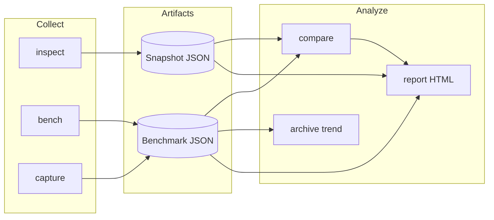
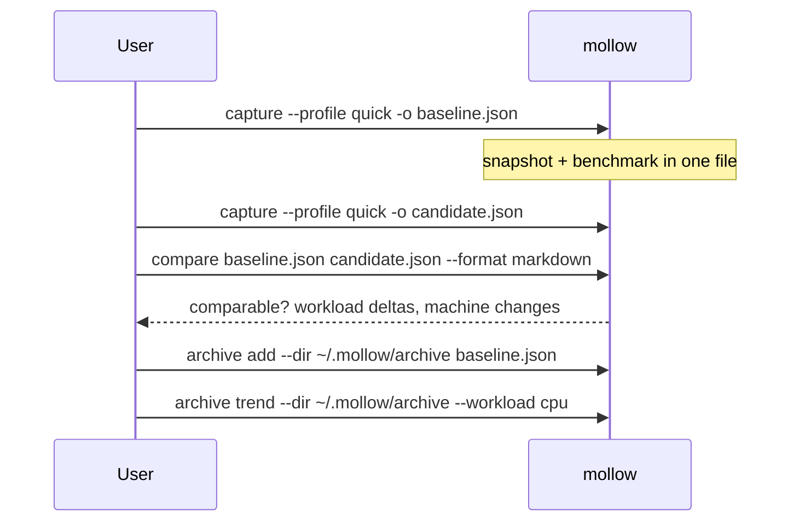

# Mollow

English | [简体中文](README-CN.md)

Cross-platform CLI for **machine inspection**, **performance baselines**, and **environment-aware comparison**.

> **Visual overview:** [Mollow showcase](https://ingeniousfrog.github.io/Mollow/) — installation paths, architecture, and typical workflows on one page.

---

## Overview

Mollow collects versioned hardware and runtime facts, runs small reproducible workloads, and compares results across time or machines—with explicit rules for when a diff is statistically meaningful.

**Primary use cases:** environment audits, regression checks, baseline tracking.

**Out of scope:** full benchmark suites, continuous profilers, system tuning, or hardware shopping tier lists.

Every probe uses a **capability model**: values are `available`, `unsupported`, `error`, or `permission_denied`—never inferred from device names alone.

---

## Features

| Area | Commands | Description |
| --- | --- | --- |
| Machine snapshot | `inspect` | OS, CPU, memory (incl. DIMM modules), storage, GPU, media, power, thermal, runtimes |
| Hardware catalog | `inspect --enrich`, `capture --enrich` | Optional offline specs, architecture summaries, benchmark reference context |
| Live monitoring | `watch` | Refresh memory, power, and thermal readings at a fixed interval |
| Benchmarks | `bench`, `capture` | Versioned CPU, memory, storage, GPU (wgpu), and platform media workloads (median + MAD) |
| Comparison | `compare` | Schema/profile validation, strict environment checks, regression classification |
| Reporting | `report` | Render artifacts as terminal, JSON, Markdown, or semantic HTML (English / 简体中文) |
| Archive | `archive` | Local baseline index and per-workload trend lines |

---

## Quick start

```bash
# macOS
brew tap ingeniousfrog/tap && brew install mollow

# Linux (Ubuntu / Debian / cloud VPS)
curl -fsSL https://raw.githubusercontent.com/ingeniousfrog/Mollow/main/packaging/install-ubuntu.sh | sudo bash

# Windows (PowerShell)
irm https://raw.githubusercontent.com/ingeniousfrog/Mollow/main/packaging/install.ps1 | iex
```

Verify and capture a baseline:

```bash
mollow --version
mollow inspect --format terminal --lang zh-CN
mollow capture --profile quick --output baseline.json
```

See [Installation](#installation) for all platforms, upgrade paths, and troubleshooting.

---

## Hardware enrichment

Use `--enrich` to attach `hardware_context` from the embedded offline catalog ([`data/hardware/catalog.json`](data/hardware/catalog.json)). Without the flag, enrichment is `unsupported` and snapshots stay minimal.

```bash
mollow inspect --enrich --format terminal --lang zh-CN
mollow capture --enrich --profile quick --output baseline.json
```

**Provides:** codename, process node, clocks, memory type, architecture summaries, reference URLs, simplified SVG diagrams (HTML), and optional local-vs-catalog benchmark deltas.

**Does not provide:** online APIs, tier-list ranks, or vendor official diagrams.

### Catalog coverage (v2026.06)

| Category | Coverage | Matching notes |
| --- | --- | --- |
| **CPU** | Intel Core, AMD Ryzen, **Apple Silicon M1–M5** | Normalized model string lookup |
| **GPU** | NVIDIA RTX, AMD Radeon RX, **Apple Silicon M1–M5** | macOS reports integrated GPU as chip name (e.g. `Apple M2`) → **Exact** match |
| **Memory** | DDR4/DDR5 profiles, LPDDR5 (Apple Silicon / mobile) | Module-level detail when OS exposes it (Linux DMI, macOS `system_profiler`) |

Apple Silicon **Pro / Max / Ultra** variants map to the same generation entry (consistent with CPU catalog granularity). GPU core counts vary by SKU and are shown from platform probing when available, not from catalog rank.

Reference scores use a **synthetic reference index** for relative context—not published benchmark reproductions.

Details: [docs/hardware-enrichment.md](docs/hardware-enrichment.md) · [ADR-0002](docs/adr/0002-hardware-enrichment-decisions.md)

---

## Sample output

Terminal output from `mollow inspect --format terminal --lang zh-CN` (v0.1.4):

<table>
  <tr>
    <td align="center"><br/><sub>Ubuntu cloud GPU (Alibaba Cloud ECS)</sub></td>
    <td align="center"><br/><sub>macOS (Apple Silicon)</sub></td>
  </tr>
</table>

---

## Workflow



**Typical baseline workflow**



---

## Installation

**Current release:** [v0.1.4](https://github.com/ingeniousfrog/Mollow/releases/tag/v0.1.4)

Prebuilt binaries: macOS (Apple Silicon + Intel), Linux x86_64 (musl static + glibc), Windows x86_64.

### Release notes

**v0.1.4**

- Snapshot and benchmark schema **v4**
- Optional `--enrich` offline hardware catalog (CPU/GPU/memory specs, architecture summaries, HTML diagrams, benchmark reference deltas)
- Apple Silicon catalog: **M1–M5** CPU and GPU (exact match on macOS chip names)
- Memory module probing (Linux DMI, macOS `system_profiler`)

**Earlier releases**

- **v0.1.3** — Readable Linux GPU names (`nvidia-smi`, `pci.ids`)
- **v0.1.2** — musl static Linux build by default; fixes `GLIBC_* not found` on older distros

### Install by platform

| Platform | Recommended | Command |
| --- | --- | --- |
| macOS | Homebrew | `brew tap ingeniousfrog/tap && brew install mollow` |
| Ubuntu / Debian / VPS | Install script (musl) | `curl -fsSL …/packaging/install-ubuntu.sh \| sudo bash` |
| Linux (other) | Install script (musl) | `curl -fsSL …/packaging/install.sh \| bash` |
| Windows | PowerShell | `irm …/packaging/install.ps1 \| iex` |
| Developers | Source | `cargo build --release -p mollow` |

Full URLs and alternatives (Scoop, winget, manual download, Homebrew on Linux): [docs/packaging.md](docs/packaging.md).

> Mollow is **not** in Debian/Ubuntu official repositories. There is no `apt install mollow`.

### Binary compatibility

| Asset | Architecture | Requirements | Default in scripts? |
| --- | --- | --- | --- |
| `mollow-x86_64-unknown-linux-musl.tar.gz` | Linux x86_64 | Static musl; Ubuntu 18.04–24.04, cloud VPS | Yes |
| `mollow-x86_64-unknown-linux-gnu.tar.gz` | Linux x86_64 | glibc 2.35+ (~ Ubuntu 22.04+) | Manual only |
| `mollow-aarch64-apple-darwin.tar.gz` | macOS ARM64 | macOS 11+ | Homebrew / script |
| `mollow-x86_64-apple-darwin.tar.gz` | macOS Intel | macOS 11+ | Homebrew / script |
| `mollow-x86_64-pc-windows-msvc.zip` | Windows x64 | Windows 10+, PowerShell 5.1+ | `install.ps1` |

Not provided: Linux ARM64, Windows ARM64 prebuilt packages. Build from source for those targets.

### Upgrade and uninstall

| Method | Upgrade | Uninstall |
| --- | --- | --- |
| Homebrew | `brew update && brew upgrade mollow` | `brew uninstall mollow` |
| Install scripts | Re-run the install script | Remove binary from install dir |
| Windows PowerShell | Re-run `install.ps1` | Delete `%LOCALAPPDATA%\Programs\Mollow\bin` |
| Scoop | `scoop update mollow` | `scoop uninstall mollow` |
| Manual | Replace binary from [Releases](https://github.com/ingeniousfrog/Mollow/releases) | Delete from `PATH` |
| Source | `git pull && cargo build --release -p mollow` | Remove built binary |

Pin a version: `MOLLOW_VERSION=0.1.4` (scripts) or `.\install.ps1 -Version 0.1.4` (Windows).

### Troubleshooting

**Linux: `GLIBC_* not found`** — You installed the glibc-linked binary on an older system. Remove the old binary and reinstall with the musl script (default since v0.1.2):

```bash
sudo rm -f /usr/local/bin/mollow ~/.local/bin/mollow
curl -fsSL https://raw.githubusercontent.com/ingeniousfrog/Mollow/main/packaging/install-ubuntu.sh | sudo bash
```

Or force musl: `MOLLOW_LINUX_TARGET=x86_64-unknown-linux-musl`.

---

## Command reference

### Shared flags

| Flag | Values | Default | Description |
| --- | --- | --- | --- |
| `--format` | `terminal`, `json`, `markdown`, `html` | per command | Output format |
| `--lang` | `english`, `zh-CN` | `english` | Report language |
| `--output <PATH>` | file path | stdout | Write to file |

Benchmark commands also accept `--profile quick|standard` ([details](docs/benchmarks.md)).

### `mollow inspect`

Collect a machine snapshot (no benchmarks).

| Option | Default | Description |
| --- | --- | --- |
| `--format` | `terminal` | Output format |
| `--enrich` | off | Attach offline hardware catalog |
| `--output` | — | Save rendered output |

```bash
mollow inspect --format json --output snapshot.json
mollow inspect --enrich --format html --lang zh-CN --output inspect.html
```

### `mollow bench`

Run benchmarks without a combined capture file.

```bash
mollow bench --profile quick --format terminal
mollow bench --profile standard --format json --output bench.json
```

### `mollow capture`

Snapshot **and** benchmark in one JSON artifact (recommended for baselines).

```bash
mollow capture --profile quick --output baseline.json
mollow capture --enrich --profile standard --output release-baseline.json
```

### `mollow compare`

Diff baseline against one or more candidates (benchmark runs or snapshots).

```bash
mollow compare baseline.json candidate.json
mollow compare baseline.json run-a.json run-b.json --format markdown -o diff.md
```

Benchmark diffs require matching schema, profile, release build, workload parameters, and environment (power, thermal). Median change threshold: **±5%** (500 basis points). See [docs/comparison.md](docs/comparison.md).

### `mollow report`

Re-render saved JSON to another format.

```bash
mollow report baseline.json --format html --output report.html
```

### `mollow watch`

Monitor memory, power, and thermal at a fixed interval.

```bash
mollow watch -i 1
mollow watch -i 5 --fields power,thermal --lang zh-CN
```

### `mollow archive`

Local baseline directory: `archive add`, `archive list`, `archive trend --workload cpu|memory|storage|gpu|media`.

```bash
mkdir -p ~/.mollow/archive
mollow capture --profile quick -o run.json
mollow archive add --dir ~/.mollow/archive run.json
mollow archive trend --dir ~/.mollow/archive --workload gpu
```

---

## Data model

### Snapshot schema (v4)

| Component | Examples |
| --- | --- |
| `system` | OS, kernel, architecture, hostname |
| `cpu` | Model, cores, ISA features |
| `memory` | Total/available RAM, swap, per-module type/speed |
| `storage` | Mount points, volume size, filesystem |
| `gpu` | Device name, vendor, APIs |
| `media` | Hardware codec capabilities |
| `power` / `thermal` | AC/battery, charge, thermal state |
| `runtimes` | rustc, cargo, git, node, python (when present) |
| `hardware_context` | Optional catalog enrichment (`--enrich`) |

Schema: [`schemas/machine-snapshot-v4.schema.json`](schemas/machine-snapshot-v4.schema.json)

### Benchmark workloads (v2)

| Domain | Workload ID | Backend |
| --- | --- | --- |
| CPU | `cpu.fnv1a-stream` | Host FNV-1a hash |
| Memory | `memory.sequential-copy` | Sequential `copy_from_slice` |
| Storage | `storage.sequential-write-read` | Temp file write/sync/read |
| GPU | `gpu.wgpu-matrix-multiply` | wgpu (Metal / Vulkan / DX12) |
| Media (macOS) | `media.videotoolbox-h264-encode` | VideoToolbox |
| Media (Windows) | `media.media-foundation-h264-decode` | Media Foundation |
| Media (Linux) | `media.vaapi-h264-decode` | VA-API |

### Benchmark profiles

| Profile | Samples | CPU input | Memory buffer | Storage file | Use case |
| --- | ---: | ---: | ---: | ---: | --- |
| `quick` | 3 | 4 MiB | 16 MiB | 8 MiB | CI smoke, frequent checks |
| `standard` | 5 | 32 MiB | 64 MiB | 64 MiB | Release baselines |

Full parameters: [docs/benchmarks.md](docs/benchmarks.md)

### Schema versions

| Artifact | Version | Path |
| --- | --- | --- |
| Machine snapshot | v4.0.0 | `schemas/machine-snapshot-v4.schema.json` |
| Benchmark run | v4.0.0 | `schemas/benchmark-run-v4.schema.json` |
| Comparison report | v2.0.0 | `schemas/comparison-report-v2.schema.json` |

---

## Platform probing

What `inspect` can collect on each OS (separate from [binary compatibility](#binary-compatibility)):

| Platform | System / CPU / memory / storage | GPU | Media | Power | Thermal |
| --- | --- | --- | --- | --- | --- |
| macOS | Native APIs, sysctl | `system_profiler` | VideoToolbox | IOKit | SMC |
| Linux | `/proc`, sysfs | DRM, nvidia-smi, pci.ids | VA-API / V4L2 | power-supply | thermal zones |
| Windows | Win32 / NT | DXGI | Media Foundation | Win32 | WMI |

---

## Development

Requires Rust **1.85+** (`rust-version` in `Cargo.toml`).

```bash
cargo fmt --all --check
cargo clippy --workspace --all-targets -- -D warnings
cargo test --workspace
cargo build --release -p mollow
```

Use **release** builds for performance baselines.

### Documentation

| Document | Topic |
| --- | --- |
| [docs/architecture.md](docs/architecture.md) | Crate boundaries, capability semantics |
| [docs/hardware-enrichment.md](docs/hardware-enrichment.md) | Offline catalog, `--enrich` |
| [docs/benchmarks.md](docs/benchmarks.md) | Workloads, profiles, statistics |
| [docs/comparison.md](docs/comparison.md) | Comparability rules |
| [docs/packaging.md](docs/packaging.md) | Install paths, Scoop, winget |
| [docs/homebrew.md](docs/homebrew.md) | Homebrew Formula workflow |
| [docs/release-verification.md](docs/release-verification.md) | Pre-release checklist |

### Releasing (maintainers)

Push a `v*` tag → [`.github/workflows/release.yml`](.github/workflows/release.yml) builds assets and publishes the GitHub Release. [homebrew-tap](https://github.com/ingeniousfrog/homebrew-tap) updates automatically when `HOMEBREW_TAP_TOKEN` is set.

After release, refresh packaging checksums:

```bash
./packaging/update-homebrew-sha256.sh <version>
./packaging/update-package-checksums.sh <version>   # when placeholders are used
```

---

## License

Apache License 2.0 — see [`LICENSE`](LICENSE).
